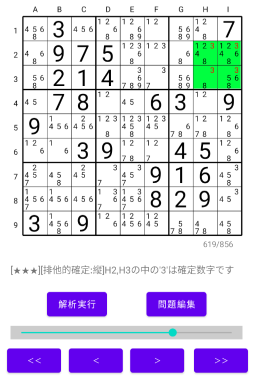

# Sudoku Solver for Android

This is application program for Android OS to solve Sudoku puzzle game. 

Sudoku player sometimes gets stuck on the way to goal. Me too even though it is easy game. This program gives hint to player to find breakthrough.

This program makes many pages (for example 800 pages). At every page, candidate number (1-9) is deleted one by one. The last remaining number is the answer number.

User will be able to find a similar page in those pages, which user got stuck, with using seekbar, "<" or ">" button. Then user will be able to find breakthrouth for next step.

User can make new puzzle by editing text, and save to file or load from file.

